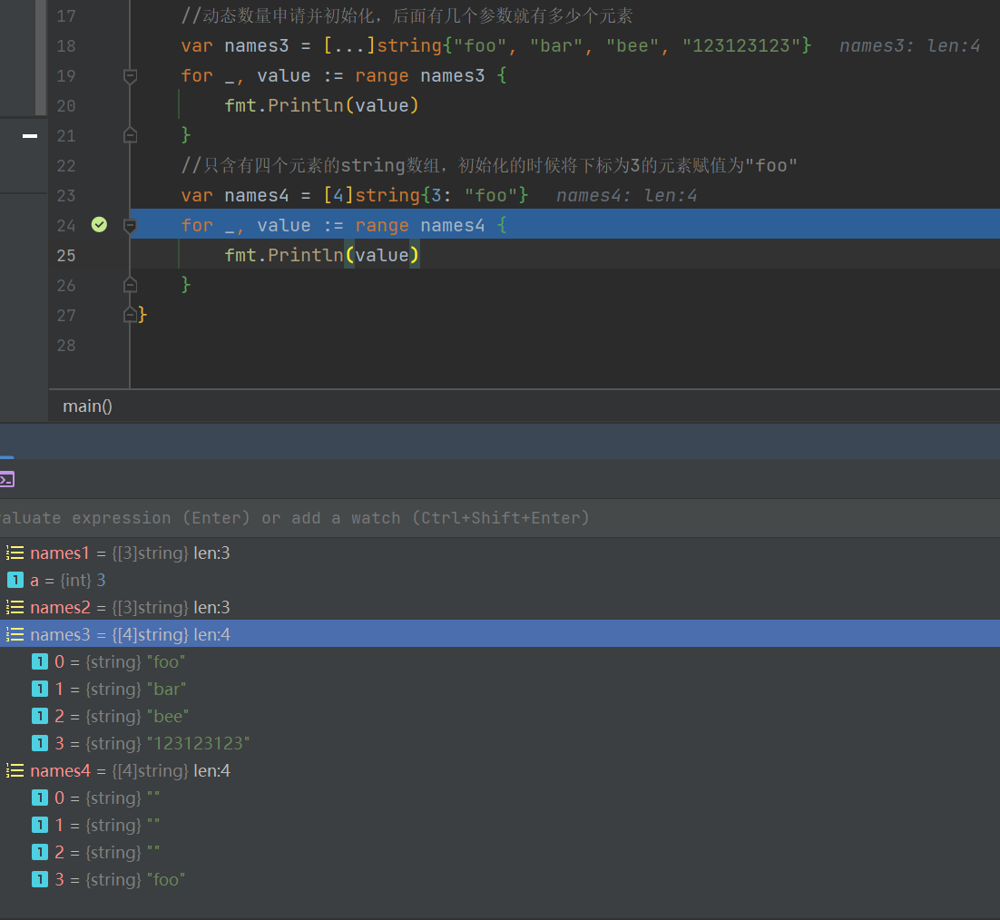
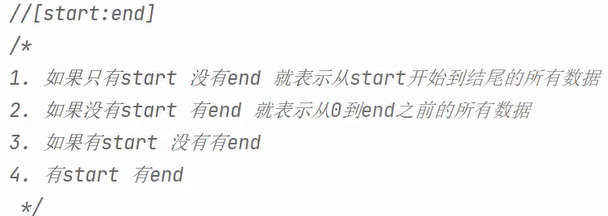
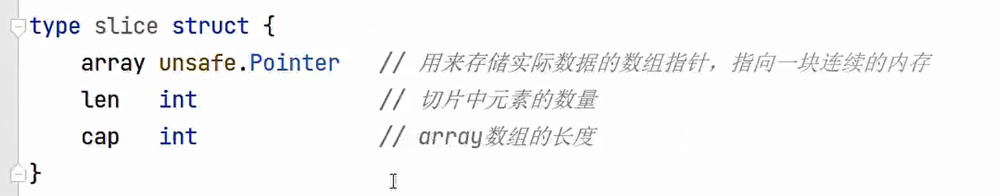

1. Go语言中的数组初始化方法比较多，支持根据参数的数量来确定数组的大小，支持对某一个位置的参数进行设定

   

2. 数组的遍历方式类似于C++中遍历std::vector<T> vet;

   可以用for(auto at: vet) 也可以for i通过下标来进行访问

3. 切片的访问可以直接通过有效下标来访问任意的一个元素，也可以通过`[start, end]`来访问某一段的内容

   

   这样的方式可以直接用来删减一个或者是几个数据

4. slice 底层存储原理实际上可以看作是一个`结构体`

   

   更改值的时候，会更改原始的值，使得其他使用有交集的数据的部分都会发生值的更改；如果是append会造成地址的更改，这个时候不会影响原始数据，所以说就不会对其他使用有交集的数据的部分都会发生值的更改
   
   ```go
   package main
   
   import "fmt"
   
   func main() {
   	data := []int{1, 2, 3, 4, 5, 6, 7, 8, 9, 10}
   	data1 := data[1:4]
   	data2 := data[2:5]
   	fmt.Println("更改前data1", data1)
   	fmt.Println("更改前data2", data2)
   	data2[0] = 666
   	fmt.Println("更改后data1", data1)
   	fmt.Println("更改后data2", data2)
   	//此时发生了更改,如果对data进行append则不会,因为append过程中地址发生改变
   	data2 = append(data2, 777, 777, 777, 777)
   	fmt.Println("再次更改后data1", data1)
   	fmt.Println("再次更改后data2", data2)
   }
   ```
   
   