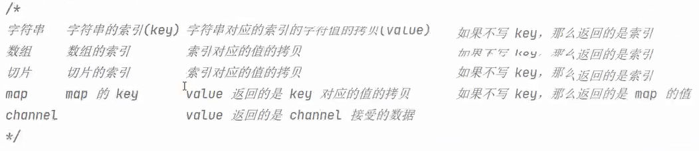
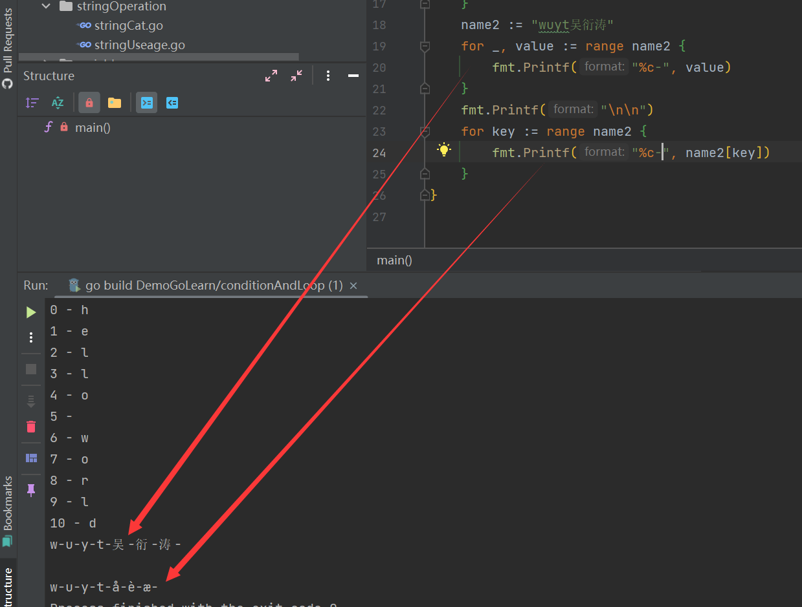
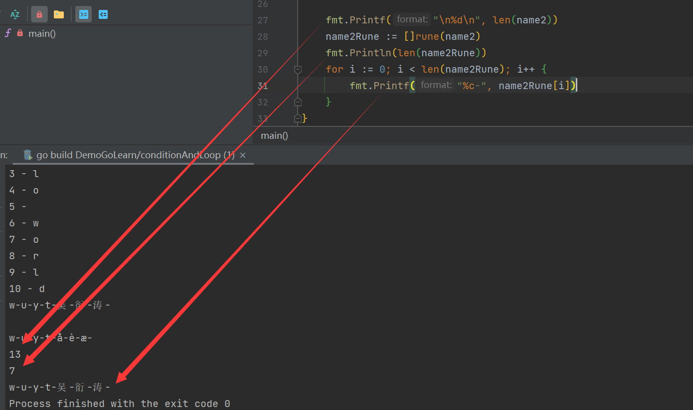

1. 在`for range`循环中，可以遍历字符串，数组，切片，map，channel

   

所以说在遍历的过程中，我们可以：

```go
for iter := range name {
   fmt.Printf("%d - %c\n", iter, name[iter])
}
```

前者为下标，后者为通过下标访问的具体的值

2. 对于有中文的字符串遍历，为了防止乱码的发生，尽量使用key, value来进行遍历，或者是转换为[]rune来完成

   



3. goto

   ```go
   goto a
   
   a:
   ```

4. switch

   ```go
   package main
   
   import "fmt"
   
   func main() {
   	day := 6
   	switch day {
   	case 1:
   		fmt.Println(1)
   	case 2:
   		fmt.Println(2)
   	case 3:
   		fmt.Println(3)
   	case 4:
   		fmt.Println(4)
   	case 5:
   		fmt.Println(5)
   	case 6:
   		fmt.Println(6)
   	default:
   		fmt.Println(7)
   	}
   
   	day = 100
   	switch {
   	case day >= 1 && day <= 31:
   		fmt.Printf("123")
   	case day >= 32:
   		fmt.Println("123456")
   	default:
   		fmt.Print("nonono")
   	}
   
   	day = 2
   	switch day {
   	case 1, 2, 3:
   		fmt.Printf("1 or 2 or 3")
   	case 4, 5, 6:
   		fmt.Printf("4 or 5 or 6")
   	}
   }
   
   ```

   
